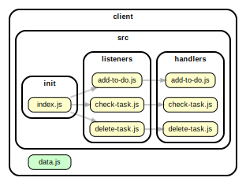

<!-- BEGIN TITLE -->

# DOCS

<!-- END TITLE -->

<!-- BEGIN TREE -->

> [interactive graph](./dependency-graph.html)

<!-- END TREE -->

<!-- BEGIN TOC -->

- public
- src
  - components
  - handlers
    - [add-to-do.js](#clientsrchandlersadd-to-dojs)
    - [check-task.js](#clientsrchandlerscheck-taskjs)
    - [delete-task.js](#clientsrchandlersdelete-taskjs)
  - init
    - [index.js](#clientsrcinitindexjs)
  - listeners
    - [add-to-do.js](#clientsrclistenersadd-to-dojs)
    - [check-task.js](#clientsrclistenerscheck-taskjs)
    - [delete-task.js](#clientsrclistenersdelete-taskjs)
  - logic
- styles
- [data.js](#clientdatajs)

---

<!-- END TOC -->

<!-- BEGIN DOCS -->

# /public

---

# /src

## /components

---

## /handlers

<a href="../../client/src/handlers/add-to-do.js" id="clientsrchandlersadd-to-dojs">../client/src/handlers/add-to-do.js</a>

## addTodo

Entry point for users adding a task to the list.
It is called each time the user clicks the "add" icon button.

| Param | Type               | Description                                          |
| ----- | ------------------ | ---------------------------------------------------- |
| event | <code>Event</code> | The event triggered when the user clicks the button. |

<a href="../../client/src/handlers/check-task.js" id="clientsrchandlerscheck-taskjs">../client/src/handlers/check-task.js</a>

## checkTask

Entry point for users marking tasks as complete.
It is called each time the user clicks the "check" icon button.

| Param | Type               | Description                                          |
| ----- | ------------------ | ---------------------------------------------------- |
| event | <code>Event</code> | The event triggered when the user clicks the button. |

<a href="../../client/src/handlers/delete-task.js" id="clientsrchandlersdelete-taskjs">../client/src/handlers/delete-task.js</a>

## deleteCheck

Entry point for users deleting tasks as complete.
It is called each time the user clicks "delete" icon button.

| Param | Type               | Description                                          |
| ----- | ------------------ | ---------------------------------------------------- |
| event | <code>Event</code> | The event triggered when the user clicks the button. |

---

## /init

<a href="../../client/src/init/index.js" id="clientsrcinitindexjs">../client/src/init/index.js</a>

---

## /listeners

<a href="../../client/src/listeners/add-to-do.js" id="clientsrclistenersadd-to-dojs">../client/src/listeners/add-to-do.js</a>

<a href="../../client/src/listeners/check-task.js" id="clientsrclistenerscheck-taskjs">../client/src/listeners/check-task.js</a>

<a href="../../client/src/listeners/delete-task.js" id="clientsrclistenersdelete-taskjs">../client/src/listeners/delete-task.js</a>

---

## /logic

---

---

# /styles

---

<a href="../../client/data.js" id="clientdatajs">../client/data.js</a>

<!-- END DOCS -->
